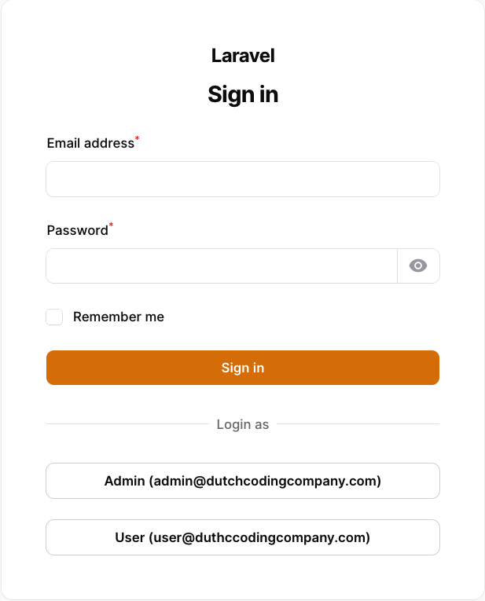

# :package_description

[](https://packagist.org/packages/:vendor_slug/:package_slug)
[](https://github.com/:vendor_slug/:package_slug/actions?query=workflow%3Arun-tests+branch%3Amain)
[](https://github.com/:vendor_slug/:package_slug/actions?query=workflow%3A"Fix+PHP+code+styling"+branch%3Amain)
[](https://packagist.org/packages/:vendor_slug/:package_slug)

# Filament Developer Logins

This panel allows you to enable one-click logins for your local Filament panels, which is useful when developing a Filament project with multiple users and various roles.



## Installation

You can install the package via composer.

```bash
composer require dutchcodingcompany/developer-logins
```

## Usage

Register the plugin in the Filament panel provider (the default file is `app/Providers/Filament/AdminPanelProvider.php`).

In the `users` method you can define the users (note: the users must exist), the key is used as a label on the login button and the value is used to search the user in the database.

```php
// ...
->plugins([
    FilamentDeveloperLoginsPlugin::make()
        ->enabled()
        ->users([
            'Admin' => 'admin@dutchcodingcompany.com',
            'User' => 'user@dutchcodingcompany.com',
        ])
]);
```

## Customization

### enabled()

By default, the plugin is disabled. You can enable it by calling the enabled() method. I strongly suggest enabling
this plugin only in the local environment. You can achieve this by using the app()->environment() method. Additionally, 
the enabled() method also accepts a closure if you wish to enable the plugin based on a custom condition.

Example:

```php
// ...
FilamentDeveloperLoginsPlugin::make()
    ->enabled(app()->environment('local'))
```

### column()

By default, the user column is set to `email`. If you want to use a different column, you can use the column() method.

Example:

```php
FilamentDeveloperLoginsPlugin::make()
    ->column('name')
```

### modelClass()

By default, the model class is set to `App\Models\User`. If you want to use a different model, you can use the modelClass() method.

Example:

```php
FilamentDeveloperLoginsPlugin::make()
    ->modelClass(Admin::class)
```

### RedirectTo()

By default, the user will be redirected using the `Filament::getUrl()` method, which directs them to the dashboard. In the case of multi-tenancy, the user will also be redirected to the correct tenant. If you prefer to use a different route, you can utilize the redirectTo() method.
```php
FilamentDeveloperLoginsPlugin::make()
    ->redirectTo('/custom-route')
```

## Testing

```bash
composer test
```

## Changelog

Please see [CHANGELOG](CHANGELOG.md) for more information on what has changed recently.

## Contributing

Please see [CONTRIBUTING](CONTRIBUTING.md) for details.

## Security Vulnerabilities

Please review [our security policy](../../security/policy) on how to report security vulnerabilities.

## Credits

- [Bram Raaijmakers](https://github.com/bramr94)
- [All Contributors](../../contributors)

## License

The MIT License (MIT). Please see [License File](LICENSE.md) for more information.
